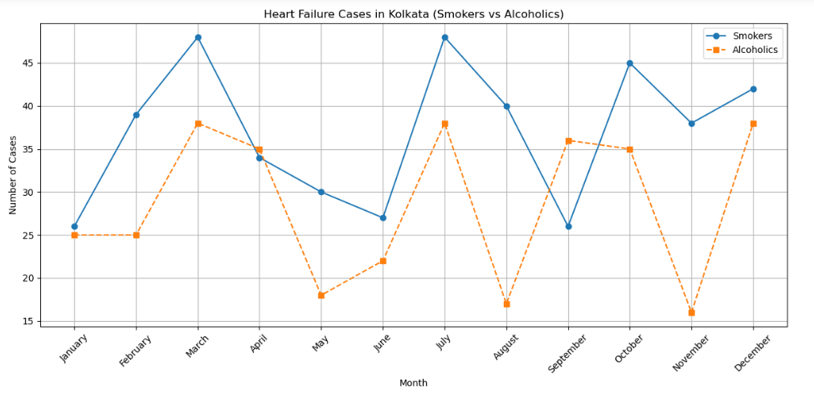

# Project7-EDA-Heart-Failures-Kolkata-Compared
> **Brief Description:** - Cases of heart failure cases in Kolkata compared for Smokers and Alcoholics.

---

## Table of Contents

- [Description](#description)
- [Video Explanation](#video)
- [Technologies Used](#technologies-used)
- [Dataset](#dataset)
- [Program Codes ](#program-codes)
- [Screenshots](#screenshots)
- [Contribution](#contributipn)
- [Contact Details](#contact-details)

---

## Description

Cases of heart failure cases in Kolkata compared for Smokers and Alcoholics during different months of the year. The plotting in this case has been done as comparable line chart with different colors.

## Video
<!--
 
-->

We are working on this section. Please check at some other time.

## Technologies-used

Python programming language, pandas, folium, IPython and geopandas package.

## Dataset

The dataset has been generated by another program. However, it is recommended that for real life analysis actual data should be collected and processed properly to get realistic results.

## Program-codes

The programs are written on jupiter notebook, You may run the program on Google colab by clicking on the colab badge below. However, the output may not be generated on colab. For that you have to download the program and run it locally. Make sure that the packages are all installed.

## Screenshots

**This program generates a line plot to compare the number of heart failure cases among smokers and alcoholics in Kolkata over a period of months. Here’s what we can infer from its output:**

- **Trend Analysis:**

  - The plot shows how the number of heart failure cases among smokers and alcoholics changes month by month. This allows for a visual comparison of the trends between these two groups.

- **Monthly Comparison:**

  - By plotting both smokers and alcoholics on the same graph, it is easy to see which group has more heart failure cases in each month. For example, if the line representing smokers is consistently higher than the line for alcoholics, it indicates that more smokers are affected by heart failure compared to alcoholics.

- **Patterns and Anomalies:**

  - The plot can reveal patterns, such as whether there are specific months where cases spike for either group. It can also highlight any anomalies, such as sudden increases or decreases in cases that may warrant further investigation.

- **Behavioral Impact:**

  - By visualizing this data, one can understand the impact of smoking and alcohol consumption on heart failure cases. It can highlight the months when interventions might be needed more urgently.

- **Public Health Insights:**

  - Public health officials can use this information to target interventions and resources more effectively. For instance, if there is a particular month with a high number of cases among smokers, awareness campaigns or medical interventions can be focused during that period.

In summary, the output of this program is a comparative line plot that provides insights into the number of heart failure cases among smokers and alcoholics in Kolkata over time. This visualization helps in understanding trends, identifying critical periods, and planning targeted public health interventions.

## Contribution

The programs are written by Santanu Karmakar

## Contact-details

If you wish to contact me, please leave a message (Preferably WhatsApp) on this number: 6291 894 897.
Please also mention why you are contacting me. Include your name and necessary details.
Thank you for taking an interest.
